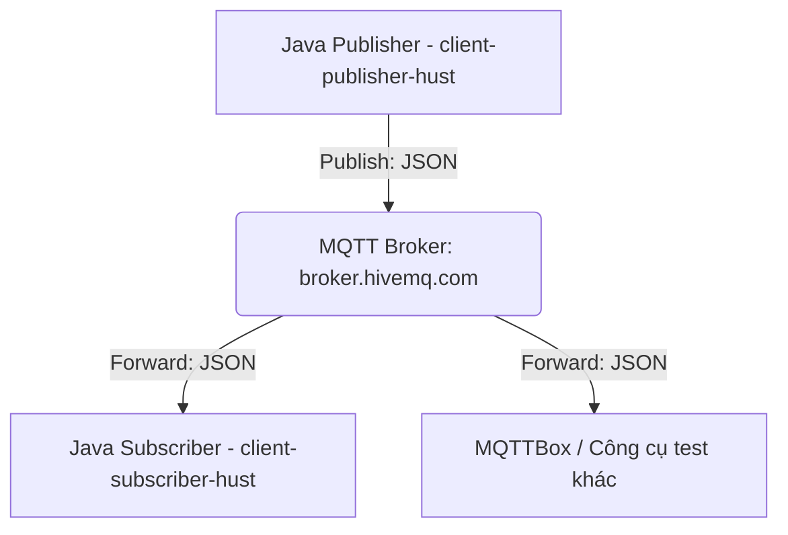

# Hướng dẫn & Phân tích chi tiết: Trao đổi dữ liệu qua MQTT bằng Java

Tài liệu này cung cấp các phân tích kiến trúc, thiết kế mã nguồn và hướng dẫn chạy chương trình Java MQTT để phục vụ bài tập số 2 (**Bài 2. Trao đổi dữ liệu sử dụng giao thức MQTT**).

---

## 1. Phân tích kiến trúc & Giao thức MQTT

**MQTT (Message Queuing Telemetry Transport)** là giao thức truyền thông điệp (messaging protocol) nhẹ, dạng publish/subscribe (xuất bản/đăng ký), được thiết kế đặc biệt cho các thiết bị IoT có băng thông thấp, độ trễ cao và kết nối không ổn định.

### Mô hình hoạt động
Mô hình truyền thông của MQTT không truyền tải trực tiếp giữa máy gửi và máy nhận, mà đi qua một máy chủ trung gian gọi là **MQTT Broker**.



- **Publisher (Người gửi):** Kết nối đến Broker và gửi các gói tin đi kèm với một **Topic** cụ thể.
- **Subscriber (Người nhận):** Kết nối đến Broker và đăng ký một hoặc nhiều **Topic** quan tâm. Khi có bất kỳ tin nhắn nào được gửi lên Topic đó, Broker sẽ tự động chuyển tiếp tin nhắn tới Subscriber.
- **Topic (Chủ đề):** Chuỗi ký tự phân cấp bằng dấu gạch chéo `/` (ví dụ: `hust/iot/sensor/data`) dùng làm địa chỉ định tuyến tin nhắn.

---

## 2. Thiết kế chương trình Java

Ứng dụng của chúng ta được chia thành các thành phần (Class) riêng biệt để đảm bảo tính module hóa và dễ bảo trì:

### 2.1. `MqttPublisher.java`
- **Mục đích:** Khởi tạo kết nối tới MQTT Broker và gửi dữ liệu cảm biến dạng JSON.
- **Thư viện sử dụng:** `org.eclipse.paho.client.mqttv3.MqttClient` để giao tiếp MQTT và `org.json.JSONObject` để đóng gói dữ liệu thành định dạng JSON.
- **Các bước thực hiện:**
  1. Khởi tạo đối tượng `MqttClient` với Broker URL và Client ID duy nhất.
  2. Tạo đối tượng cấu hình `MqttConnectOptions` (clean session = true, timeout = 10s).
  3. Kết nối tới Broker: `client.connect()`.
  4. Đóng gói thông tin (Tên thiết bị, nhiệt độ, độ ẩm) vào `JSONObject`.
  5. Tạo tin nhắn `MqttMessage` từ chuỗi JSON byte, đặt mức dịch vụ QoS = 1 (đảm bảo tin nhắn được gửi tối thiểu 1 lần).
  6. Phát tin nhắn lên topic đích: `client.publish()`.
  7. Ngắt kết nối để giải phóng tài nguyên hệ thống.

### 2.2. `MqttSubscriber.java`
- **Mục đích:** Lắng nghe, nhận tin nhắn từ Broker trên topic đã đăng ký, phân tích cú pháp (parse) gói tin JSON và in kết quả ra màn hình console.
- **Đặc trưng:** Hiện thực giao diện `MqttCallback` của Paho để nhận sự kiện bất đồng bộ từ Broker.
- **Các bước thực hiện:**
  1. Kết nối với Broker tương tự Publisher nhưng dùng Client ID khác biệt để tránh xung đột kết nối.
  2. Gán callback xử lý: `client.setCallback(this)`.
  3. Đăng ký nhận tin nhắn trên topic: `client.subscribe(topic)`.
  4. Khi có tin nhắn đến, phương thức `messageArrived(String topic, MqttMessage message)` sẽ tự động được kích hoạt.
  5. Đọc chuỗi payload của tin nhắn, khởi tạo một `JSONObject` để trích xuất các trường dữ liệu: `"DeviceName"`, `"temperature"`, `"humidity"`.
  6. Hiển thị thông tin được parse rõ ràng lên giao diện console.

### 2.3. `MqttApp.java`
- **Mục đích:** Giao diện điều khiển tương tác (Command Line Interface) cho phép người dùng cấu hình Broker/Topic, bật/tắt Subscriber trong luồng chạy nền (Background Thread), nhập và gửi dữ liệu thủ công.
- **Đặc trưng:** Sử dụng luồng riêng biệt (`Thread`) cho các thao tác mạng (publish/subscribe) để tránh làm đơ giao diện CLI khi nhập liệu.

---

## 3. Định dạng dữ liệu trao đổi (JSON Payload)

Dữ liệu cảm biến được đóng gói theo định dạng JSON như sau:
```json
{
    "DeviceName": "my-mqtt-client",
    "temperature": 30.0,
    "humidity": 60.0
}
```

---

## 4. Hướng dẫn biên dịch và chạy chương trình

Do hệ thống của bạn sử dụng bộ biên dịch Java đi kèm với phần mềm IntelliJ IDEA, chúng tôi cung cấp các script tự động cấu hình đường dẫn để bạn dễ dàng làm việc mà không cần cài đặt JDK toàn cục.

### Bước 1: Biên dịch chương trình
Mở terminal tại thư mục này và chạy lệnh:
```bash
./build.sh
```
*Script sẽ tự động tạo thư mục `bin` và sử dụng `javac` trong JBR JDK để biên dịch mã nguồn của bạn cùng với các file thư viện `.jar` trong thư mục `lib/`.*

### Bước 2: Chạy chương trình
Chạy lệnh sau để khởi động giao diện tương tác:
```bash
./run.sh
```

---

## 5. Hướng dẫn kiểm tra với công cụ MQTTBox

Để kiểm tra chương trình hoạt động chính xác theo yêu cầu bài tập:

1. **Khởi động Subscriber trên Java:**
   - Chạy ứng dụng bằng `./run.sh`.
   - Chọn phím `1` để bật Subscriber. Bạn sẽ thấy thông báo: `[Subscriber] Subscribed and waiting for messages...`.

2. **Cấu hình trên MQTTBox:**
   - Tạo một kết nối mới (Create Client) tới MQTT Broker:
     - **MQTT Client Name:** `MQTTBox Test Client`
     - **Protocol:** `mqtt / tcp`
     - **Host:** `broker.hivemq.com:1883`
     - Nhấn **Save** để kết nối.

3. **Kiểm tra chức năng gửi nhận:**
   - **Test gửi từ Java -> MQTTBox:**
     - Trên cửa sổ MQTTBox, tạo phần **Subscribe** với Topic là `hust/iot/sensor/data` (hoặc topic bạn tự đặt) rồi bấm **Subscribe**.
     - Trở lại chương trình Java, chọn phím `3` để gửi dữ liệu. Nhập tên thiết bị, nhiệt độ, độ ẩm mong muốn.
     - Kiểm tra trên MQTTBox xem gói tin JSON có hiển thị đúng cấu trúc không.
   - **Test gửi từ MQTTBox -> Java (subscriber):**
     - Trên cửa sổ MQTTBox, tạo phần **Publish** với Topic là `hust/iot/sensor/data` và Payload dạng JSON. Ví dụ:
       ```json
       {
         "DeviceName": "MQTTBox-Sender",
         "temperature": 28.5,
         "humidity": 55.0
       }
       ```
     - Nhấn nút **Publish** trên MQTTBox.
     - Quan sát màn hình console của chương trình Java. Subscriber chạy ngầm sẽ ngay lập tức bắt được gói tin, parse JSON và hiển thị dạng:
       ```text
       -------------------------------------------
       [Subscriber] New Message Received!
       [Subscriber] Topic: hust/iot/sensor/data
       [Subscriber] Raw Payload: {"DeviceName":"MQTTBox-Sender","temperature":28.5,"humidity":55}
       [Subscriber] Parsed Fields:
         - Tên thiết bị (DeviceName) : MQTTBox-Sender
         - Nhiệt độ (Temperature)     : 28.5 °C
         - Độ ẩm (Humidity)           : 55.0 %
       -------------------------------------------
       ```
